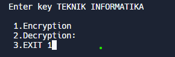
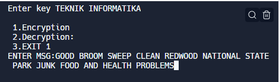
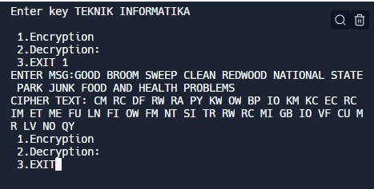

| NIM     | 312010042      |
| Nama    | INDIRA ALINE    |
| Kelas   | TI.20.A.1        |

## Membuat program Playfair cipher
Berikut langkah-langkah membuat program playfair cipher menggunakan bahasa pemrograman python:</p>

## Membuat program di replit
Saya membuat program ini dengan website replit. Silahkan kunjungi websitenya : https://replit.com.</p>

## Membuat file baru direplit </p>
1. Pilih menu "CREATE" pada halaman replit. </p>

2. Tampilan template fungsi untuk memilih bahasa pemrograman membuat filenya. Disini saya menggunakan bahasa pemrograman python dan beri nama filenya "Enkripsi Playfair Cihper", lalu klik "Create Repl" </p>

3. Selanjutnya mengisi/mengetik codingannya:
```python

key=input("Enter key")
key=key.replace(" ", "")
key=key.upper()
def matrix(x,y,initial):
    return [[initial for i in range(x)] for j in range(y)]
    
result=list()
for c in key: #storing key
    if c not in result:
        if c=='J':
            result.append('I')
        else:
            result.append(c)
flag=0
for i in range(65,91): #storing other character
    if chr(i) not in result:
        if i==73 and chr(74) not in result:
            result.append("I")
            flag=1
        elif flag==0 and i==73 or i==74:
            pass    
        else:
            result.append(chr(i))
k=0
my_matrix=matrix(5,5,0) #initialize matrix
for i in range(0,5): #making matrix
    for j in range(0,5):
        my_matrix[i][j]=result[k]
        k+=1
def locindex(c): #get location of each character
    loc=list()
    if c=='J':
        c='I'
    for i ,j in enumerate(my_matrix):
        for k,l in enumerate(j):
            if c==l:
                loc.append(i)
                loc.append(k)
                return loc
            
def encrypt():  #Encryption
    msg=str(input("ENTER MSG:"))
    msg=msg.upper()
    msg=msg.replace(" ", "")             
    i=0
    for s in range(0,len(msg)+1,2):
        if s<len(msg)-1:
            if msg[s]==msg[s+1]:
                msg=msg[:s+1]+'X'+msg[s+1:]
    if len(msg)%2!=0:
        msg=msg[:]+'X'
    print("CIPHER TEXT:",end=' ')
    while i<len(msg):
        loc=list()
        loc=locindex(msg[i])
        loc1=list()
        loc1=locindex(msg[i+1])
        if loc[1]==loc1[1]:
            print("{}{}".format(my_matrix[(loc[0]+1)%5][loc[1]],my_matrix[(loc1[0]+1)%5][loc1[1]]),end=' ')
        elif loc[0]==loc1[0]:
            print("{}{}".format(my_matrix[loc[0]][(loc[1]+1)%5],my_matrix[loc1[0]][(loc1[1]+1)%5]),end=' ')  
        else:
            print("{}{}".format(my_matrix[loc[0]][loc1[1]],my_matrix[loc1[0]][loc[1]]),end=' ')    
        i=i+2        
                 
def decrypt():  #decryption
    msg=str(input("ENTER CIPHER TEXT:"))
    msg=msg.upper()
    msg=msg.replace(" ", "")
    print("PLAIN TEXT:",end=' ')
    i=0
    while i<len(msg):
        loc=list()
        loc=locindex(msg[i])
        loc1=list()
        loc1=locindex(msg[i+1])
        if loc[1]==loc1[1]:
            print("{}{}".format(my_matrix[(loc[0]-1)%5][loc[1]],my_matrix[(loc1[0]-1)%5][loc1[1]]),end=' ')
        elif loc[0]==loc1[0]:
            print("{}{}".format(my_matrix[loc[0]][(loc[1]-1)%5],my_matrix[loc1[0]][(loc1[1]-1)%5]),end=' ')  
        else:
            print("{}{}".format(my_matrix[loc[0]][loc1[1]],my_matrix[loc1[0]][loc[1]]),end=' ')    
        i=i+2        
while(1):
    choice=int(input("\n 1.Encryption \n 2.Decryption: \n 3.EXIT"))
    if choice==1:
        encrypt()
    elif choice==2:
        decrypt()
    elif choice==3:
        exit()
    else:
        print("Choose correct choice")
```
</p>

4. Selanjutnya klik "Run" untuk menampilkan output programnya. Setelah di "Run" akan muncul output: "ENTER KEY", Maksud dari ENTER KEY yaitu kata kuncinya. Disini saya menggunakan kata kunci "TEKNIK INFORMATIKA", setelah menginputkan kata kunci lalu klik enter pada keyboard.</p>
</p>

5. Lalu akan muncul outputnya: </p>
 1.Encryption </p>
 2.Descryption </p>
 3.EXIT </p>
Terdapat 3 menu pada outputnya. Saya akan menginputkan Encryption jadi pilih menu "1. Encryption".</p>
</p>

6. Maka akan muncul outputnya: </p>
  " ENTER MSG:" </P>
  Fungsi dari output tersebut yaitu untuk menginputkan enkripsi Playfair Cihper pada plaintext. Disini saya menginputkan plaintextnya yaitu: "GOOD BROOM SWEEP CLEAN REDWOOD NATIONAL STATE PARK JUNK FOOD AND HEALTH PROBLEMS". </p>
 </p>

 7. Setelah klik enter, maka akan muncul output CIPHER TEXT. </p>
 </p>

 -----------------------------------------------------------------------------------------------------------------------------------------------
 </p>